## 머신러닝이란?

기계학습 Machine Learning : 기계를 학습시켜 스스로 결정하도록 하는 기술 

---

## 궁리하는 습관

스마트폰을 사용하기 위해서 스마트폰의 제조과정을 전부 알 필요는 없듯이 일단 머신러닝의 사용자가 되어 다양한 문제를 해결해보자.

한계를 느끼게 되고 그 한계가 충분히 절망스러울 때 코딩과 수학공부를 시작하면 된다.

### 몽상가에서 혁명가로 

꿈을 꾸는 몽상가가 혁명가가 되는 시대 오고 있다. 꿈을 꾸자. 계획을 세우자.

### 마음의 소리

'나의 생활 추적기'

1. 하루하루 시간을 어디에, 얼만큼, 어떻게 쓰고 있는지 알고싶다.
2. 아이폰 스크린타임, 깃허브 커밋 수 등을 종합해서 행동 카테고리 별로 분류, 분석해서 일주일, 한달 간격으로 체크하고 싶다.
3. 분류/분석이 완료된 결과를 일주일 단위, 한달 단위로 알려주고 평가한다. 
4. 행동 카테고리의 분류 및 분석하는 기능을 만드는데 머신러닝을 이용한다.

---

## Teachable Machine

[Teachable Machine](https://teachablemachine.withgoogle.com/)은 Image Project, Audio Project, Pose Project 세가지 부분의 머신러닝 서비스를 제공한다. 웹캠 또는 사진이미지를 이용해서 모델을 학습시키고 학습된 모델을 파일로 다운받을 수 있다.

---

## 모델 Model

'머신러닝'이란 판단력을 기계에게 부여하는 기술이라고 할 수 있고 이런 판단력을 **모델**이라고 부른다. 또 이 모델을 만드는 과정을 **학습**이라고 부른다. 

학습이 잘 되어야 좋은 모델을 만들 수 있고 모델이 좋아야 추측의 정확도가 높아진다.

---

## 사물 인터넷

인터넷으로 사물을 제어한다는 의미에서 IoT(Internet of Things), 즉 사물인터넷이라고 한다.

여기에 머신러닝 기술을 적용하면 장치에 연결된 센서를 통해 데이터를 수집하고 기계가 알아서 작동하도록 만들 수 있다.

```
사물인터넷 = 코딩 + 네트워크 + 전자공학 + 기계공학
```

---

## 표

표는 행과 열로 이루어져 있다. 가로를 **행**, 세로를 **열**이라고 한다. 표는 데이터들의 모임으로, **데이터 셋(data set)** 이라고도 부른다.

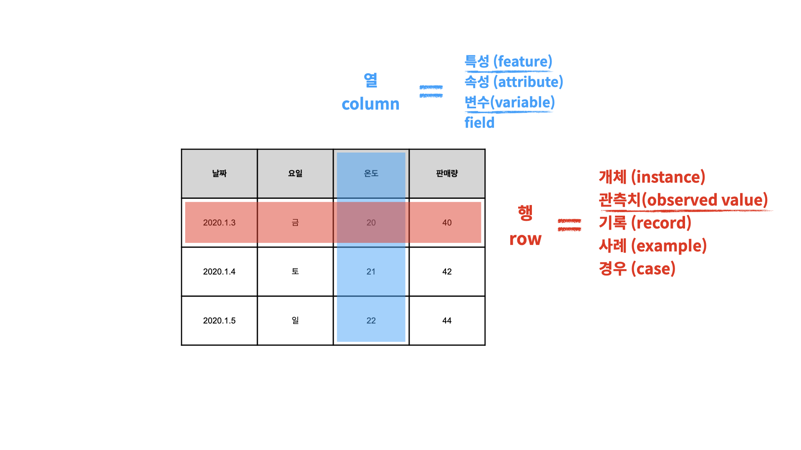

데이터 셋에서 각각의 행은 개체를 나타내고, 열은 그 개체의 특징을 나타낸다.

데이터 산업에서 행과 열은 아래와 같이 표현된다.

- 행(row)
  - **개체(instance)**
  - 관측치(observed value)
  - 기록(record)
  - 사례(example)
  - 경우(case)

- 열(column)
  - **특성(feature)**
  - 속성(attribute)
  - 변수(variable)
  - field

---

## 독립변수와 종속변수

변수(variable)는 변할 수 있는 것을 뜻한다. 표에서 변수는 열을 말한다.

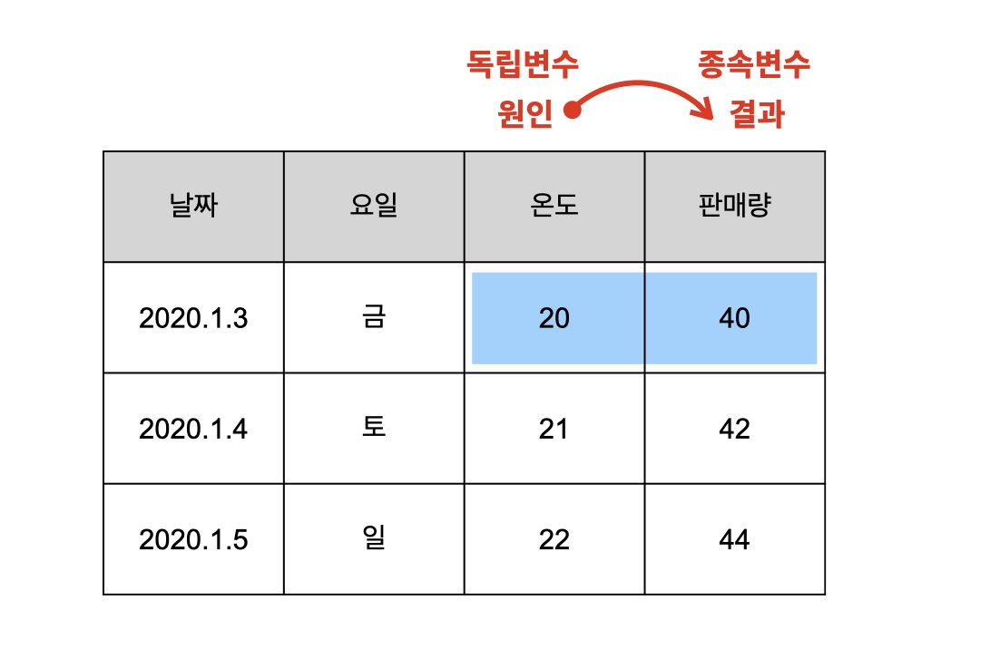

독립변수(independent variable)는 **원인**이 되는 열을 말하며 결과에 영향을 받지 않는다.

종속변수(dependent variable)는 **결과**가 되는 열이고 원인에 종속되어 발생한다.

### 상관관계

한쪽의 값이 바뀔 때 다른 쪽의 값도 바뀐다면, 두 개의 특성을 '서로 상관이 있다'고 한다. 

### 인과관계

각 열이 원인과 결과의 관계일 때 인과관계가 있다고 한다.

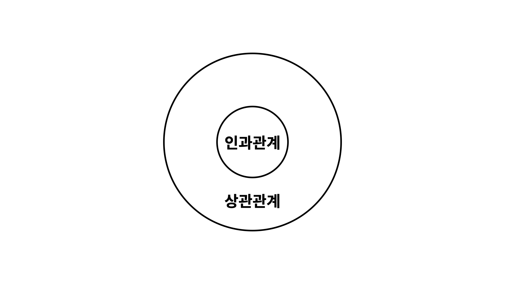

인과관계는 상관관계에 포함된다. 즉, 모든 인과관계는 상관관계이다. 하니만 모든 상관관계가 인과관계는 아니다.

### 정리

- 독립변수는 원인이다.
- 종속변수는 결과이다.
- 독립변수와 종속변수의 관계를 인과관계라고 한다.
- 인과관계는 상관관계에 포함된다.

---

## 머신러닝의 분류


지도학습은 역사적이다. 과거의 원인과 결과를 바탕으로 미라의 결과를 추측하는 것이 목적이다. 그래서 원인인 독립변수와 결과인 종속변수가 꼭 필요하다. 

비지도학습은 탐험적이다. 주어진 데이터들의 성격을 파악하는 것이 목적이다. 따라서 독립변수와 종속변수의 구분이 중요하지 않고 데이터만 있으면 된다.

---

## 지도학습

지도학습(supervied learning)의 '지도'는 기계를 가르친다는 의미이다. 즉, 데이터로 컴퓨터를 학습시켜서 모델을 만드는 방식을 **지도학습**이라고 한다.

지도학습은 크게 회귀(regression)와 분류(classification)로 나뉜다.

### 회귀

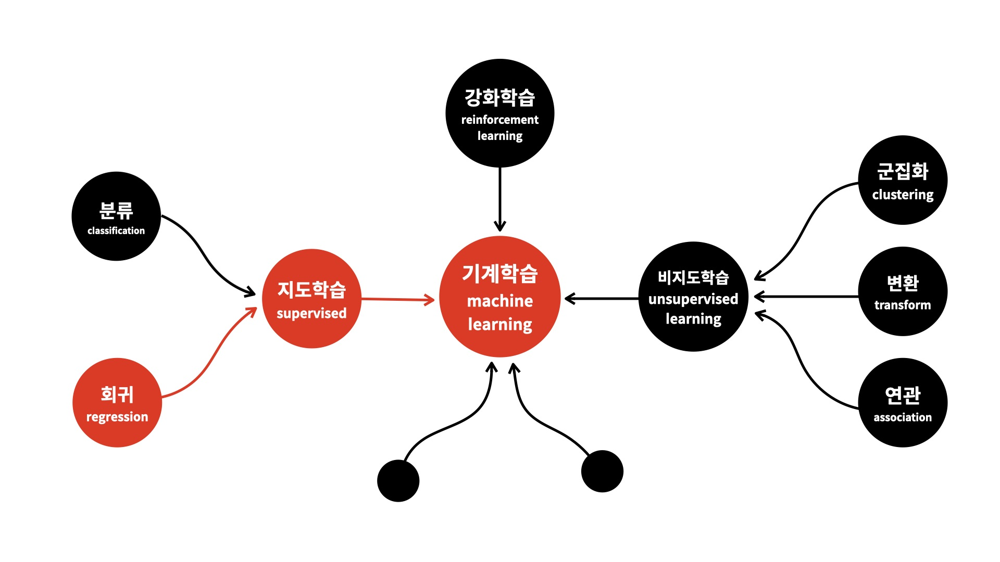

가지고 있는 데이터에 독립변수와 종속변수가 있다. 예측하고 싶은 종속변수가 숫자, 즉 **양적데이터(quantitative data)** 일 때 보통 회귀라는 방법을 사용한다.

### 분류

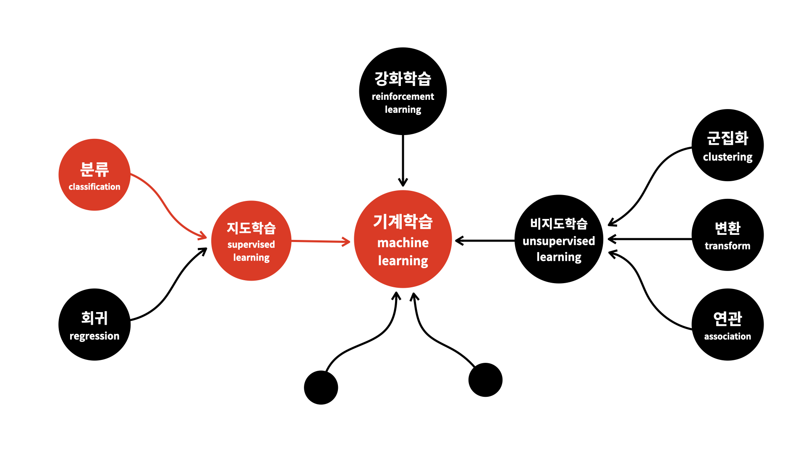

가지고 있는 데이터에 독립변수와 종속변수가 있다. 예측하고 싶은 종속변수의 결과가 이름, 즉 **범주형 데이터(categorical data)** 일 때 분류라는 방법을 사용한다.

---

## 비지도학습

비지도 학습(unsupervised learning)은 지도학습에 포함되지 않는 방법들로, 대체로 기계에게 데이터에 대한 통찰력을 부여하는 것이라고 말할 수 있다. 주로 데이터의 성격을 파악하거나 데이터를 정리정돈하는 것에 사용된다.

비지도 학습의 사례로는 '군집화'와 '연관규칙', '변환규칙'이 있다.

### 군집화

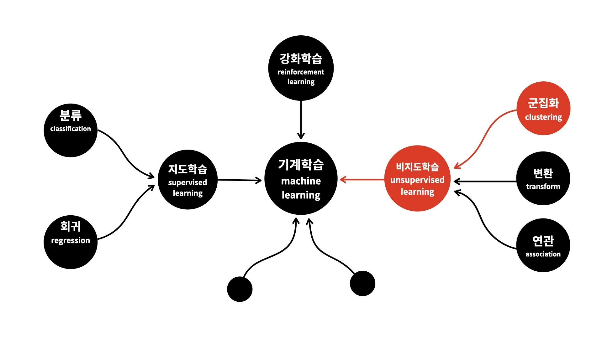

군집화(clustering)는 비슷한 행을 그룹핑하는 것이다. 어떤 대상들을 구분해서 그룹을 만드는 것이 군집화이고, 분류는 어떤 대상이 어떤 그룹에 속하는지를 판단하는 것이다.

군집화는 좌표상에서 서로 가까운 관측치를 찾아준다. 좌표상에서 가깝다는 것은 데이터가 서로 비슷하다는 의미이다.

### 연관규칙학습

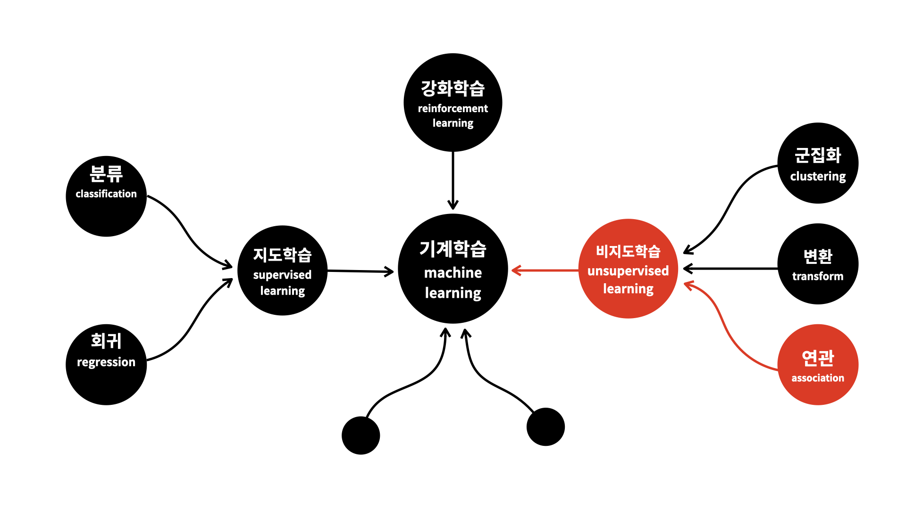

연관규칙학습(association rule learning)은 서로 연관된 특성(열)을 찾아내 그룹핑해주는 것이다. '추천' 기능은 대부분 연관규칙을 이용한 것이라고 보면 된다. 

예를 들어 제품들간의 연관성을 파악할 수 있다면 하나의 상품을 구매하는 고객에게 구입가능성이 매우 높은 다른 상품을 추천할 수 있다.

### 비지도변환

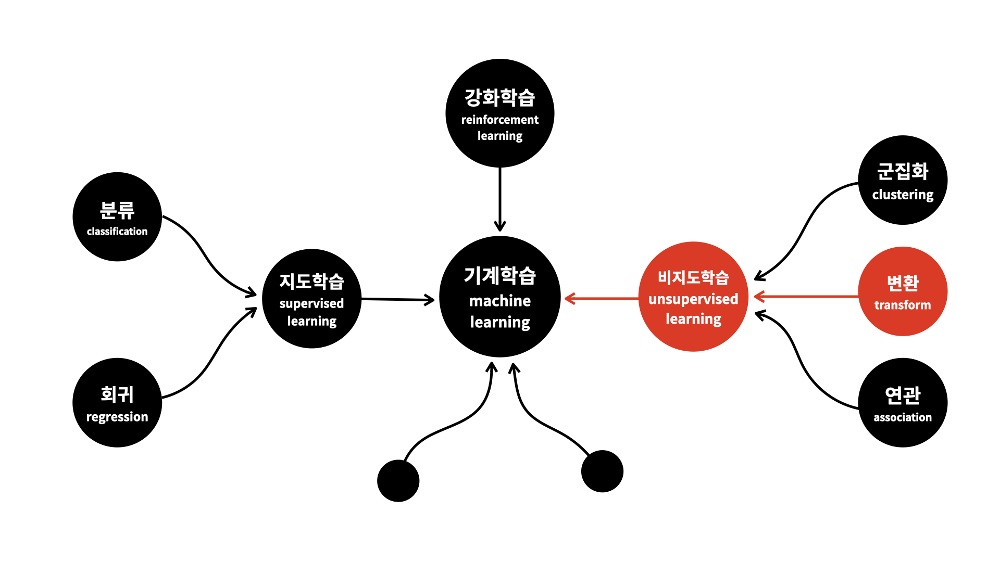

비지도변환(unsupervised transform)은 데이터를 새롭게 표현해 사람이나 다른 머신러닝 알고리즘에 원래 데이터보다 쉽게 해석할 수 있도록 만드는 알고리즘이다. 크게 시각화(visualization)와 차원축소(dimensionality reduction)가 있다.

#### 시각화

**시각화(visualization)** 알고리즘은 레이블이 없는 대규모의 고차원 데이터를 넣으면 도식화가 가능한 2D 나 3D 표현을 만들어진다.  이런 알고리즘은 가능한 한 구조를 그대로 유지하려 하기 때문에 데이터가 어떻게 조직되어 있는지 이해할 수 있고 예상하지 못한 패턴을 발견할 수도 있다.

#### 차원축소

비슷한 작업으로 너무 많은 정보를 잃지 않으면서 데이터를 간소화하려는 **차원축소(dimensionality reduction)** 가 있다. 차원축소의 한가지 방법은 상관관계가 있는 여러 특성을 하나로 합치는 것이다. 

예를 들어 차의 주행거리와 연식은 아주 큰 상관관계가 있다. 차원축소 알고리즘을 이융해 두 특성을 차의 마모정도를 나타내는 하나의 특성으로 합칠 수 있다. 이를 **특성추출(feature extraction)** 이라고 한다.

---

## 강화학습

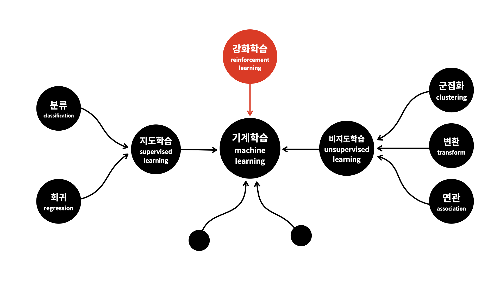

강화학습(reinforcement learning)은 학습을 통해 능력을 향상시킨다는 점에서 지도학습과 비슷하다. 차이점은 강화학습은 경험을 통해 어떻게 하는 것이 더 좋은 결과를 낼 수 있는지를 학습하고 결과를 향상시킨다.

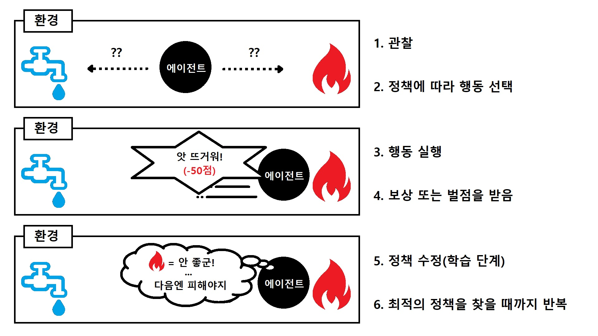

강화학습에서는 학습하는 시스템을 **에이전트(agent)** 라고 부르고 환경(environment)을 관찰해 어떤 상태(state)에서 어떤 행동(action)을 실행할지 판단하고 그 결과로 **보상(reward)** 또는 **벌점(penalty)** 을 받는다. 시간이 지나면서 가장 큰 보상을 얻기 위해 **정책(policy)** 이라고 부르는 최상의 전략을 스스로 학습힌다. 정책은 주어진 상황에서 에이전트가 어떤 행동을 선택해야 할지 결정한다.

---

## 나에게 필요한 머신러닝을 찾는 방법

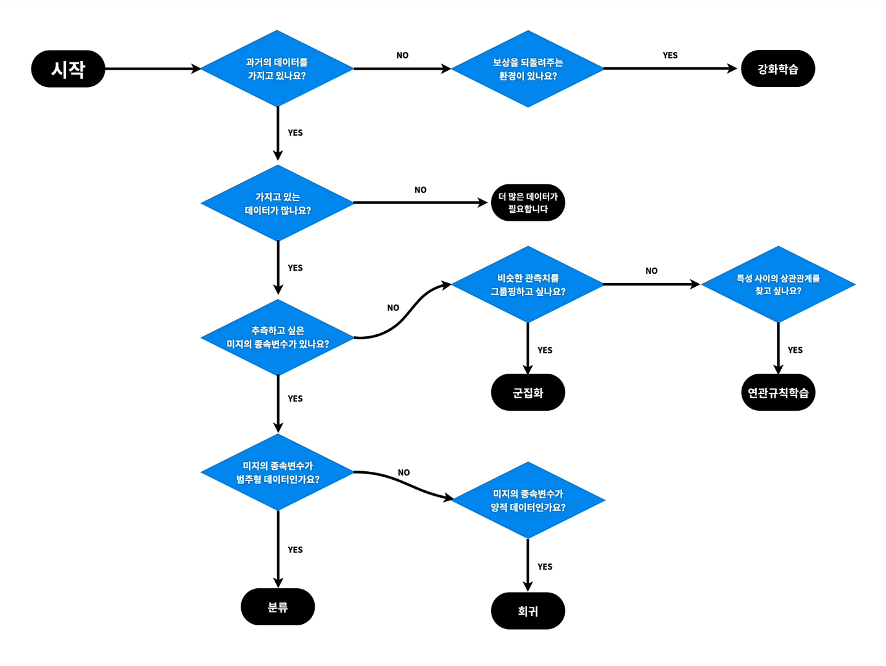