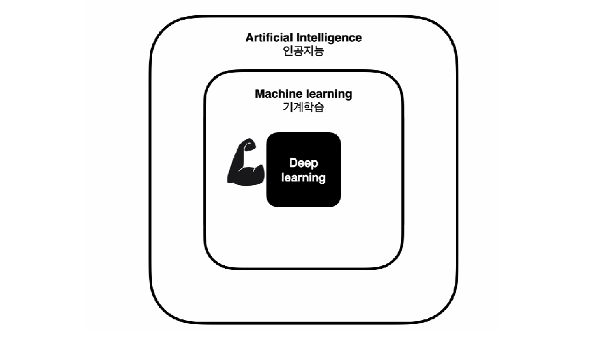

## 인공신경망 

### 소개

```
Neural Network = 인공신경망 = Deep Learning
```



머신러닝은 인공지능을 구현하는 가장 유망한 분야이다. 머신러닝은 지도학습, 비지도학습, 강화학습과 같은 기술들을 포괄한다. 가장 먼저 살펴볼 지도학습은 회귀와 분류 문제를 해결하고 이런 문제를 다루는 알고리즘에는 인공신경망, Decision Tree, Random Forest, KNN, SVM 등이 있다.

기술이 발전하면서 세부적인 작동원리를 알지 못하더라도 딥러닝으로 문제를 해결할 수 있는 도구들이 등장했는데 이것을 **Library**라고 부른다. 라이브러리는 앞으로 배울 인공신경망(딥러닝) 알고리즘을 코드로 이용할 수 있게 한다. 라이브러리의 종류에는 Tensorflow, PyTorch, Caffe2, theano 등이 있다. 이 중에서 우리가 사용할 라이브러리는 Tensorflow이다.

### 목표와 전략

#### 기존 딥러닝 입문수업 

1. 파이썬기초
2. 데이터입문
3. 머신러닝 이해
4. 딥러닝의 원리
5. 딥러닝 구현

기존의 딥러닝 입문수업은 '입문'이라고 하지만 실제 딥러닝을 구현하기 까지의 과정이 길어 초심자 혼자 전과정을 끝까지 해내기 쉽지 않았다.

#### 본 강의의 차별점

```
[원인이 되는 코드 작성 -> 결과 확인]의 과정을 반복하며 딥러닝의 원리와 개념을 스스로 깨닫기
```

본 강의에서는 먼저 원인이 되는 코드를 작성하고 그 결과를 직접 확인하면서 작성한 코드를 어떤 분야에 적용할 수 있을지를 생각해볼 것이다. 그리고 다시 다른 코드를 작성하고 결과를 확인하는 과정을 반복한다. 

그렇게 실제로 딥러닝을 구현하고 이용하는 과정에 반복적으로 노출되고 익숙해지면서 궁극적으로는 딥러닝의 원리와 개념을 스스로 깨닫는 것이 본 강의의 목표이다.

### 지도학습 살펴보기

지도학습은 인과관계를 갖춘데이터를 모델의 구조에 학습시켜 모델을 구현하고 실제 데이터를 넣어 이용한다.

1. 과거의 데이터 준비 - 원인(독립변수)과 결과(종속변수) 인식
2. 모델의 구조 만들기
3. 데이터로 모델 학습(fit)하기 - 모델을 데이터에 맞게 피팅 하기
4. 모델 이용하기

---

## 코드 살펴보기

### 과거의 데이터 가져오기

```python
dir = 'machine-learning-with-opentutorials/csv/boston.csv' # 데이터 디렉토리
boston = pd.read_csv(dir) # 위의 디렉토리에서 파일의 데이터 읽어오기

print(boston.shape) # 불러온 데이터의 모양 확인
print(boston.columns) # 불러운 데이터의 컬럼(특성) 확인
print(boston.head())  # 데이터의 전체 행렬

# 데이터의 독립변수
independent = boston[['crim', 'zn', 'indus', 'chas', 'nox', 'rm', 'age', 'dis', 'rad', 'tax', 'ptratio', 'b', 'lstat']]

# 데이터의 종속변수
dependent = boston[['medv']]

# 독립변수와 종속변수의 모양 확인
print(independent.shape, dependent.shape)
```

> 결과

```python
# 불러온 데이터의 모양 확인
(506, 14)

# 불러온 데이터의 컬럼(특성) 확인
Index(['crim', 'zn', 'indus', 'chas', 'nox', 'rm', 'age', 'dis', 'rad', 'tax',
       'ptratio', 'b', 'lstat', 'medv'],
      dtype='object')

# 데이터의 전체 행렬
      crim    zn  indus  chas    nox     rm   age     dis  rad  tax  ptratio       b  lstat  medv
0  0.00632  18.0   2.31     0  0.538  6.575  65.2  4.0900    1  296     15.3  396.90   4.98  24.0
1  0.02731   0.0   7.07     0  0.469  6.421  78.9  4.9671    2  242     17.8  396.90   9.14  21.6
2  0.02729   0.0   7.07     0  0.469  7.185  61.1  4.9671    2  242     17.8  392.83   4.03  34.7
3  0.03237   0.0   2.18     0  0.458  6.998  45.8  6.0622    3  222     18.7  394.63   2.94  33.4
4  0.06905   0.0   2.18     0  0.458  7.147  54.2  6.0622    3  222     18.7  396.90   5.33  36.2

# 독립변수와 종속변수의 모양 확인
(506, 13) (506, 1)
```

### 모델을 구성하는 코드

```python
# 독립변수 13개의 입력을 받는 입력레이어를 구성  : X1, X2, ... , X13
X = tf.keras.layers.Input(shape=[13])

# 13개의 입력으로부터 종속변수 1개의 덴스레이어 출력을 만드는 구조
# 이 구조로부터 만들어지는 수식 : Y = W1X1 + W2X2 + ... + W13X13 + b
Y = tf.keras.layers.Dense(1)(X)


model = tf.keras.models.Model(X, Y)
model.compile(loss='mse')
```

위에서 만든 모델은 뉴런 하나로 이루어져 있다. 뉴런은 실제 두뇌세포의 이름이고 인공신경망에서 이런 뉴런의 역할을 하는 것이 위에서 만든 모형과 수식이다.

```
Y = W1X1 + W2X2 + ... + W13X13 + b
```

이 모형을 **퍼셉트론**이라고 하고, `W1, W2, ..., W3`를 **가중치(Weight)**, `b`는 **편향(bias)**이라고 한다.

